  

  

## **Academic Background**
- **University of Sindh (IMCS), Jamshoro | BS Computer Science (2023 - 2027)**
- **Google AI Professional Certificate | Coursera (In Progress)**

<h2 align="center">Tᴇᴄʜ sᴛᴀᴄᴋ & Lᴀᴛᴇsᴛ ʙʟᴏɢs</h2>
<picture>
  <source media="(prefers-color-scheme: dark)" srcset="./Skills_Animation_Dark.gif">
  <source media="(prefers-color-scheme: light)" srcset="./Skills_Animation_White.gif">
  
</picture>
 

<h3 align="left">Current Learning</h3>
<ul align="left">
  <li>Expanding full-stack skills with Next.js, Node.js and Express.</li>
  <li>Building and integrating AI/ML features into real products.</li>
  <li>Automating workflows and backend logic using n8n.</li>
  <li>Working with Firebase, MongoDB and PostgreSQL for data handling.</li>
  <li>Understanding cloud deployment via Railway and Vercel.</li>
  <li>Sharpening problem-solving with Data Structures and Algorithms.</li>
</ul>

 

<h2 align="center"> Fᴇᴀᴛᴜʀᴇᴅ Pʀᴏʲᴇᴄᴛs</h2>

| Project | Description | Tech Stack |
|---|---|---|
| **VerdexAI** | AI-powered hiring platform | Next.js, Node.js, Express, MongoDB |
| **AI Tutor - PLR System** | Personalized Learning Recommendation system for adaptive tutoring | Python, AI/ML |
| **BIN-KHALID Dairy Farm** | Dairy farm management system built for own family business | Flask, SQLite |
| **Restaurant Management System** | End-to-end restaurant operations management | Python, Flask, SQLite, Bootstrap |
| **Event Management System** | Platform for organizing and managing events | Python, Flask, SQLite, Bootstrap |
| **URL Shortener** | Lightweight link shortening service | Python, Flask, SQLite, Bootstrap |
| **n8n Automations** | Multiple workflow automation projects | n8n |

<!-- GitHub Stats -->

  
  

<h2 align="center"> Cᴏɴɴᴇᴄᴛ Wɪᴛʜ Mᴇ </h2>

  
  &nbsp;&nbsp;

  
  &nbsp;&nbsp;

  
  &nbsp;&nbsp;

  
  &nbsp;&nbsp;

  
  &nbsp;&nbsp;

  

 

  

  

  

 
